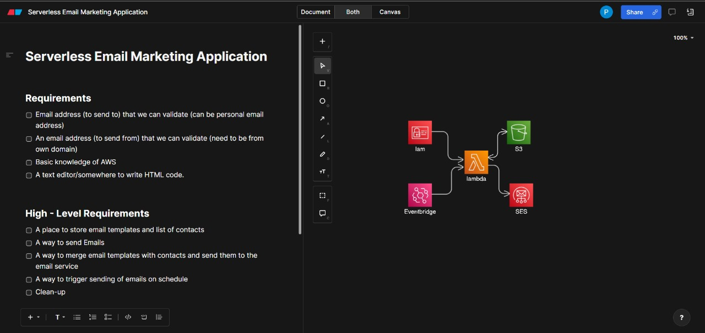
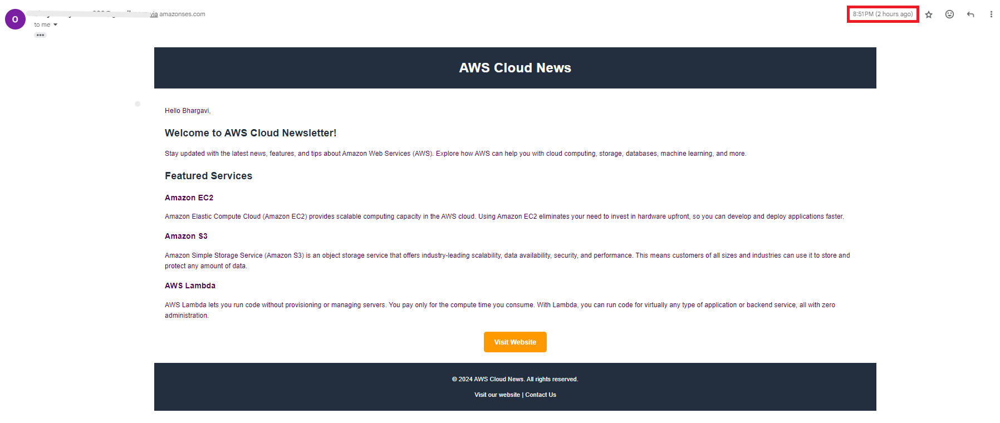

# Serverless Email Marketing Application

This serverless email marketing application leverages AWS cloud services to send tailored emails to a contact list. The solution employs AWS Lambda, Amazon S3, AWS SES, Amazon EventBridge, and IAM to deliver a scalable and cost-efficient system.

## Architecture

## Features
- **Serverless**: Utilizes AWS Lambda to run code without the need for server management.
- **Event-Driven**: Employs Amazon EventBridge to trigger Lambda functions based on predefined schedules.
- **Storage**: Manages email templates and contact data using Amazon S3.
- **Email Sending**: Delivers customized emails through AWS SES.
- **Secure**: Uses AWS IAM to handle permissions and policies.

## Prerequisites
- AWS Account
- Enabled AWS services (Lambda, S3, SES, EventBridge, IAM)

## Setup Instructions
### 1. Plan and Design
- Use tools like https://app.eraser.io/ or similar to plan your architecture and key components.

### 2. Create S3 Buckets
- Set up an S3 bucket to store your email template and `contacts.csv` file.

### 3. Upload Files
- Upload the email template (including the `{{FirstName}}` placeholder) and the `contacts.csv` file to the S3 bucket.
- [Email Template](email_template.html)
- [Contacts CSV](contacts.csv)

### 4. Configure Amazon SES
- Verify your sender domain with Amazon SES:
  1. Access the Amazon SES console.
  2. In the navigation pane, select **Identity Management** and then **Domains**.
  3. Click on **Verify a New Domain**.
  4. Enter your domain name in the **Verify a New Domain** dialog box and select **Verify This Domain**.
  5. Follow the instructions to add the DNS records to your domain's DNS settings to complete verification.
  6. After successful verification, the domain is ready for use!

  If you do not have a domain, you will need to create an identity and verify it for each email you plan to send.

### 5. Create Lambda Function
- Set up a Lambda function to:
  - Retrieve the email template and `contacts.csv` from the S3 bucket.
  - Replace the `{{FirstName}}` placeholder in the template with information from the CSV file.
  - Use AWS SES to send the emails.

  Refer to the [Lambda Function Code](Lambda_Function.txt) for detailed implementation guidance.

### 6. Configure IAM Policies
- Develop and attach appropriate IAM policies to grant the Lambda function access to S3, SES, and other necessary services.

### 7. Schedule EventBridge Event
- Create an EventBridge rule to trigger the Lambda function at specified intervals, e.g., schedule the event to send emails at 22:40.

## Results
- Verify email delivery by checking your inbox at the designated time.

